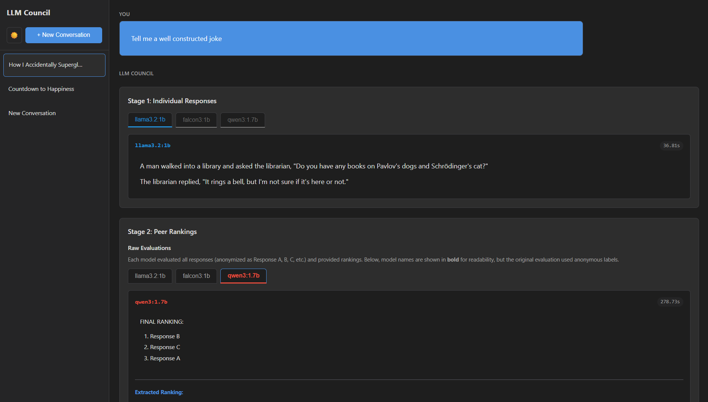

# LLM Council - Local Deployment & Refactoring

## 👥 Team Information
**Student:** Alan Casasnovas    
**TD Group:** CDOF1  
**Project Type:** Solo Project



---

## 📋 Project Overview

This project is a refactored and extended version of the original LLM Council concept by Andrej Karpathy. The original implementation relied on cloud-based APIs (OpenRouter) to aggregate responses from multiple Large Language Models (LLMs).

Our objective was to decentralize this architecture. We have successfully migrated the entire system to run locally using **Ollama**. The result is a distributed-style multi-LLM system where models communicate via REST APIs to form a "Council," resulting in a synthesized final answer generated by a dedicated Chairman LLM.

### Key Features
- **Local Execution:** All LLMs run locally via Ollama, ensuring data privacy and zero API costs.
- **Distributed Architecture:** The backend communicates with LLMs via REST APIs, allowing for easy scaling to multiple physical machines.
- **3-Stage Workflow:**
    1.  **First Opinions:** Multiple models answer independently.
    2.  **Review & Ranking:** Models anonymously review and rank peers' answers.
    3.  **Chairman Final Answer:** A designated model synthesizes all inputs.
- **User Interface:** A React-based dashboard to inspect intermediate outputs and the final consensus.

---

## 🚀 Setup & Installation Instructions

### Prerequisites
1.  **Python 3.8+**
2.  **Node.js 16+** (for Frontend)
3.  **Ollama** ([Download Here](https://ollama.com))

### Step 1: Environment Configuration (Ollama)
1.  Install and run Ollama:
    ```bash
    ollama serve
    ```
2.  Pull the required models used in the council:
    ```bash
    ollama pull llama3.2:1b
    ollama pull falcon3:1b
    ollama pull qwen3:1.7b
    ollama pull gemma3n:e2b
    ```

### Step 2: Backend Setup
1.  Navigate to the backend directory:
    ```bash
    cd backend
    ```
2.  Install dependencies (ensure `httpx`, `fastapi`, `uvicorn`, `python-dotenv` are installed):
    ```bash
    pip install fastapi uvicorn httpx python-dotenv
    ```

### Step 3: Frontend Setup
1.  Navigate to the frontend directory:
    ```bash
    cd frontend
    ```
2.  Install dependencies:
    ```bash
    npm install
    ```

---

## ▶️ Running the Demo

1.  **Start the Local LLM Server:**
    Ensure Ollama is running in a terminal window: `ollama serve`

2.  **Start the Backend API:**
    Open a new terminal in the project root and run:
    ```bash
    python -m backend.main
    ```
    *The API will start on `http://localhost:8001`.*

3.  **Start the Frontend:**
    Open a third terminal in the `frontend` folder and run:
    ```bash
    npm run dev
    ```
    *The UI will open (usually at `http://localhost:5173`).*

4.  **Execute the Workflow:**
    - Open the web interface.
    - Click "+ New Conversation".
    - Ask a complex question (e.g., "Explain the benefits of nuclear fusion").
    - Watch the **Stage 1** independent answers appear (with latency tracking).
    - Observe the **Stage 2** peer rankings.
    - Read the **Stage 3** Chairman's final synthesis.

---

## 📝 Technical Report

### 1. Design Decisions

**Choice of Local Inference Framework:**
We selected **Ollama** as the inference engine. Ollama provides a standardized REST API interface that is compatible with the OpenAI SDK format. This decision simplified the migration from OpenRouter (which also uses OpenAI-compatible APIs) and allowed us to maintain the original backend logic with minimal changes to the request handling code.

**Distributed Architecture Pattern:**
Although running as a solo project on a single machine, the codebase is designed to be **network-agnostic**.
- **Configuration:** The `OLLAMA_BASE_URL` is defined via environment variables.
- **Scalability:** To deploy this on multiple machines (as required for group projects), one would simply change the `OLLAMA_BASE_URL` to point to the IP address of the machine hosting the specific model. The backend requires zero code changes to function across a LAN.

**Technology Stack:**
- **Backend:** Python (FastAPI) was retained for its native asynchronous support, which is crucial for handling parallel requests to multiple LLMs concurrently.
- **Frontend:** React (Vite) provides a responsive, real-time interface capable of handling Server-Sent Events (SSE) for streaming the council's workflow.

### 2. Chosen LLM Models

We selected models that balance speed with reasoning capability within the constraints of local deployment on typical hardware:

**Council Members (Evaluators):**
1.  **`llama3.2:1b`**: Extremely fast, good for quick generation, often used for initial brainstorming.
2.  **`falcon3:1b`**: A science-focused model, useful for providing rigorous logic despite its small size.
3.  **`qwen3:1.7b`**: Slightly larger, provides more nuanced answers than the 1b models while still being responsive.

**Chairman (Synthesizer):**
- **`gemma3n:e2b`**: Used for the final synthesis. We require a model with strong instruction-following capabilities to merge conflicting viewpoints into a coherent final answer. This model strikes a balance between performance and quality by being trained on a massive dataset before being reduced for efficiency.

### 3. Improvements Over the Original Repository

We implemented several enhancements to improve functionality, stability, and user experience:

**A. Performance Monitoring (Latency Tracking)**
- *Implementation:* Modified the `ollama.py` backend to record `request.duration`.
- *Impact:* The frontend now displays the exact time taken (in seconds) for each model to generate their response in Stage 1 and Stage 2. This allows users to benchmark model performance visually.

**B. Robust Ranking Logic**
- *Problem:* Small local models often hallucinate in the ranking stage (e.g., listing "Response A" twice or inventing "Response C").
- *Solution:* Refactored `parse_ranking_from_text` in `backend/council.py` to use a `set`-based deduplication algorithm. This ensures that if a model repeats a ranking, the system ignores the duplicate, maintaining the integrity of the aggregate score.

**C. Enhanced User Interface (UI/UX)**
1.  **Dark / Light Mode:** Implemented a React Context theme system (`ThemeContext.jsx`) allowing users to toggle between visual modes.
2.  **Consistent Color Coding:** Developed a hashing algorithm (`getModelColor`) that assigns a unique, consistent color to each model (e.g., Llama is Red, Qwen is Blue). This color is maintained across Stage 1 (Tabs) and Stage 2 (Ranks) improving readability.
3.  **Conversation Management:** Added full support for deleting conversations via a new DELETE endpoint in the FastAPI backend and a corresponding UI button in the Sidebar.
4.  **Safety/Defensive Programming:** Added rigorous null-checking in `Stage2.jsx` to prevent white-screen crashes caused by malformed JSON or missing data fields from older conversation logs.

---

## 🤖 Generative AI Usage Statement

**Declaration:**
I declare that I have used Generative AI tools to assist in the completion of this project.

**Tools & Models Used:**
- **GLM-4.7 (z.ai)**
- **Copilot (VSCode Autocomplete)**

**Purpose of Usage:**
1.  **Code Refactoring:** Assisted in translating the original OpenRouter API calls into the Ollama REST API format.
2.  **Debugging:** Used to identify and fix issues related to relative imports in Python and React Component lifecycle errors (white screen crashes).
3.  **Algorithm Design:** Consulted for the logic regarding list deduplication in the parsing functions.
4.  **UI/UX Improvements:** Generated ideas and code for enhancing the user interface, including color-coding strategies and theme toggling implementations.
5.  **Documentation:** Used to draft and refine the structure and phrasing of this `README.md` and technical report.